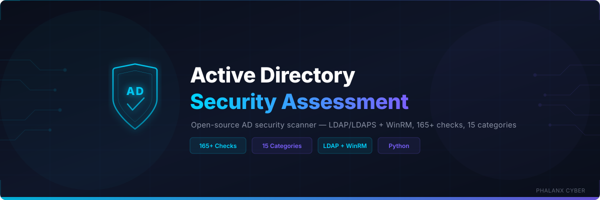

<p align="center">
  
</p>

<p align="center">
  <strong>Open-source Python-based security assessment for Microsoft Active Directory environments</strong>
</p>

<p align="center">
  <a href="#security-check-categories"></a>
  <a href="#security-check-categories"></a>
  <a href="LICENSE"></a>
  
</p>

---

## Overview

Connects to Active Directory via **LDAP/LDAPS** and optionally **WinRM** to audit **165+ security checks** across 15 categories — Kerberos attacks, privilege escalation, AD CS misconfigurations (ESC1-ESC8), password policy, trust relationships, authentication weaknesses, and more. Generates interactive HTML and JSON reports with posture scoring, PowerShell remediation commands, and compliance mapping.

### Key Capabilities

- **165+ security checks** across 15 categories with PowerShell remediation commands
- **Read-only assessment** — LDAP search + PowerShell Get-* commands only, never modifies AD
- **Dual data sources** — LDAP/LDAPS for AD objects + WinRM for registry/audit checks (optional)
- **Posture scoring** — 0-100 score with letter grades (A-F)
- **AD CS coverage** — ESC1-ESC8 certificate template and CA misconfigurations
- **Interactive HTML reports** — Self-contained dark-theme report with severity filters and search
- **CI/CD integration** — Exit codes based on severity (0=clean, 1=HIGH, 2=CRITICAL)

---

## Security Check Categories

| Category | Checks | Focus Areas |
|----------|-------:|-------------|
| **Domain Configuration** | 6 | Functional level, AD Recycle Bin, machine account quota, DC OS, stale DCs |
| **Kerberos Security** | 8 | Kerberoasting, AS-REP roasting, unconstrained/constrained/RBCD delegation, DES, krbtgt age |
| **Password Policy** | 12 | Min length, complexity, lockout, history, reversible encryption, FGPP, stale passwords |
| **Privileged Accounts** | 11 | DA/EA/SA membership, stale admins, orphaned adminCount, Kerberoastable admins, dangerous groups |
| **Group Policy** | 5 | Audit policy, PowerShell logging, Credential Guard, LAPS, unlinked GPOs |
| **LDAP Security** | 4 | LDAP signing, channel binding, anonymous bind, LDAPS enforcement |
| **DNS Security** | 4 | Zone transfers, dynamic updates, scavenging, WPAD block list |
| **Trust Relationships** | 4 | SID filtering, selective authentication, bidirectional trusts |
| **Certificate Services (AD CS)** | 5 | ESC1 (SAN+client auth), ESC2 (Any Purpose), ESC6 (EDITF flag), HTTP enrollment |
| **Replication Security** | 3 | DCSync permissions, SYSVOL/DFSR, replication health |
| **Object Permissions** | 3 | Pre-Win2K group, domain ACLs, AdminSDHolder tampering |
| **Service Accounts** | 5 | gMSA adoption, admin membership, stale passwords, default container |
| **Authentication Security** | 7 | NTLMv1, LM hash, WDigest, SMB signing, SMBv1, NTLM restriction |
| **Lateral Movement** | 4 | LAPS deployment, RDP restrictions, Restricted Admin, Remote Credential Guard |
| **Audit & Logging** | 4 | Audit policy, event log size, PowerShell logging, command-line auditing |

---

## Quick Start

### Prerequisites

- Python 3.9+
- Network access to a Domain Controller (LDAP 389/636, WinRM 5985/5986)
- AD account with read access (Domain Users minimum, Domain Admins for full coverage)

### Installation

```bash
git clone https://github.com/Krishcalin/Active-Directory-Security-Assessment.git
cd Active-Directory-Security-Assessment
pip install -r requirements.txt
```

### Usage

```bash
# Full scan with HTML + JSON reports
python ad_security_scanner.py --server dc01.corp.com --domain corp.com \
  --user scanner@corp.com --password MyP@ss --html report.html --json report.json

# NTLM authentication
python ad_security_scanner.py --server 10.0.0.1 --domain corp.com \
  --user CORP\\scanner --password MyP@ss --auth ntlm

# LDAP only (no WinRM)
python ad_security_scanner.py --server dc01.corp.com --domain corp.com \
  --user scanner@corp.com --password MyP@ss --no-winrm

# LDAPS (encrypted)
python ad_security_scanner.py --server dc01.corp.com --domain corp.com \
  --user scanner@corp.com --password MyP@ss --ssl

# Specific categories
python ad_security_scanner.py --server dc01.corp.com --domain corp.com \
  --user scanner@corp.com --password MyP@ss --checks kerberos_security,password_policy
```

---

## CLI Reference

| Option | Description | Default |
|--------|-------------|---------|
| `--server` | Domain Controller IP or hostname | *required* |
| `--domain` | AD domain name (e.g., corp.com) | *required* |
| `--user` | Username (user@domain or DOMAIN\\user) | *required* |
| `--password` | Password | *required* |
| `--port` | LDAP port | 389 (636 with --ssl) |
| `--ssl` | Use LDAPS | false |
| `--auth` | Authentication method (simple/ntlm) | simple |
| `--no-winrm` | Skip WinRM-based checks | false |
| `--checks` | Comma-separated check categories | all |
| `--profile` | YAML scan profile path | none |
| `--html` | HTML report output path | none |
| `--json` | JSON report output path | none |
| `-v` | Verbose logging | false |

### Available Check Categories

`domain_config` `kerberos_security` `password_policy` `privileged_accounts` `group_policy` `ldap_security` `dns_security` `trust_relationships` `certificate_services` `replication_security` `object_permissions` `service_accounts` `authentication_security` `lateral_movement` `audit_logging`

---

## Data Sources

| Source | Port | Required | Coverage |
|--------|------|----------|----------|
| **LDAP** | 389 | Yes | ~70% — Domain config, Kerberos, passwords, privileges, trusts, AD CS, services |
| **LDAPS** | 636 | Preferred | Same as LDAP but encrypted |
| **WinRM** | 5985/5986 | Optional | ~30% — Audit policy, SMB signing, WDigest, Credential Guard, DNS, NTLM |

WinRM-dependent checks are gracefully skipped with INFO notifications when unavailable.

---

## Running Tests

```bash
python -m unittest tests.test_scanner -v
```

28 unit tests with mock LDAP responses — no live AD required.

---

## Repository Structure

```
ad_security_scanner.py              # Main CLI entry point
checks/                             # 15 check modules
  domain_config.py                  #   Functional level, Recycle Bin, DCs
  kerberos_security.py              #   Kerberoasting, delegation, krbtgt
  password_policy.py                #   Password settings, lockout, FGPP
  privileged_accounts.py            #   DA/EA/SA, stale admins, dangerous groups
  group_policy.py                   #   Audit, LAPS, Credential Guard
  ldap_security.py                  #   LDAP signing, channel binding
  dns_security.py                   #   Zone transfers, scavenging, WPAD
  trust_relationships.py            #   SID filtering, selective auth
  certificate_services.py           #   AD CS ESC1-ESC8
  replication_security.py           #   DCSync, SYSVOL/DFSR
  object_permissions.py             #   Pre-Win2K, AdminSDHolder
  service_accounts.py               #   gMSA, admin membership
  authentication_security.py        #   NTLMv1, WDigest, SMB signing
  lateral_movement.py               #   LAPS, RDP, Restricted Admin
  audit_logging.py                  #   Audit policy, event logs
utils/
  ldap_client.py                    # LDAP/LDAPS client (read-only)
  winrm_client.py                   # WinRM client (Get-* only)
  report_generator.py               # HTML + JSON reports
  severity.py                       # Posture scoring
config/
  default_profile.yaml              # Default scan profile
tests/
  test_data/mock_responses.json     # Mock LDAP data
  test_scanner.py                   # 28 unit tests
assets/
  banner.svg                        # Repository banner
```

---

## Exit Codes

| Code | Meaning |
|------|---------|
| `0` | No HIGH or CRITICAL findings |
| `1` | HIGH severity findings detected |
| `2` | CRITICAL severity findings detected |

---

## License

MIT — see [LICENSE](LICENSE) for details.
